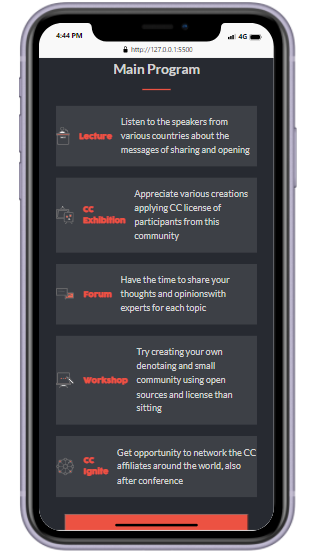
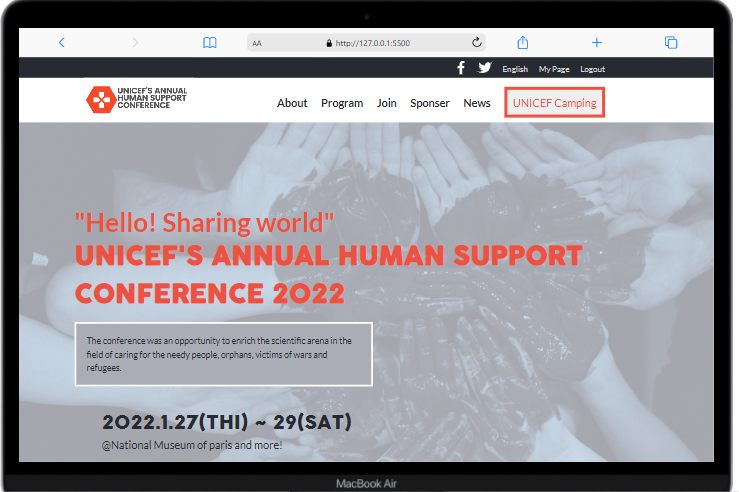

<!-- Feel Free to Add, Update, Delete Any Section you find needs so -->

# UNICEF'S ANNUAL HUMAN SUPPORT CONFERENCE

> .This project is Myfirst Capstobe project Like real world Projects, It is about a conference for charitable organization to help needy people, orphans and refugees made with html,css and javascript

## Built With

- Languages: _**HTML, CSS, JavaScript**_
- Frameworks: _**N/A**_
- Technologies used: _**GIT, GITHUB, LINTERS**_

## Additional tools
 - Google fonts

## Live Demo

[See My project Live here](https://livedemo.com)

## Video of the project description

[Watch from here](https://www.loom.com/share/212aa8b87d534f1caddd07a0fa0a4527)

## Authors

<!-- Only Change Username for Different Accounts -->

👤 **Reem**

 Platform | Badge |
 --- | --- |
 **GitHub**  | 
 **Twitter** | 
 **LinkdIn** | 

## 🤝 Contributing

Contributions, issues, and feature requests are welcome!

Feel free to check the [issues page](https://github.com/MrRamoun/WEBDEV/issues).

## Show your support

Give a ⭐️ if you like this project!

## Acknowledgments

- The Original design idea by (https://www.behance.net/adagio07) in Behance.
- Hat tip to anyone whose code was used
- Inspiration
- etc

## 📝 License

This project is [MIT](/LICENSE) licensed.
